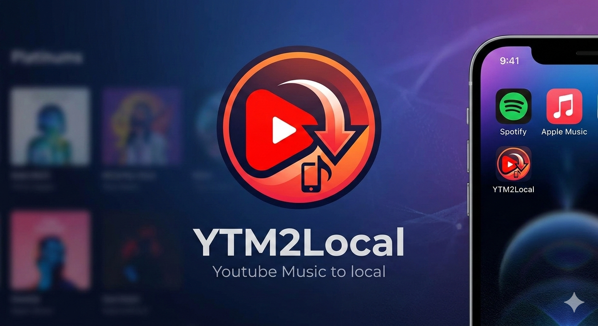

<p align="center">
  
</p>

<p align="center">
  Download your YouTube Music liked songs as local audio files.
</p>

---

## Features

- Authenticate with your YouTube Music account via OAuth
- Browse and sync your liked songs library
- Download tracks as high-quality audio (MP3/M4A via yt-dlp + ffmpeg)
- Embedded metadata and album art
- Download queue with progress tracking
- Configurable download directory and format
- Fully offline after download -- no streaming required

## Installation

Download the latest installer from [Releases](../../releases).

Run the setup wizard and launch YTM2Local from your Start Menu or Desktop.

## Build from Source

**Prerequisites:** Node.js 18+, Git

```bash
git clone https://github.com/SolberLight/ytm2local
cd ytm2local
npm install
```

Place `yt-dlp.exe`, `ffmpeg.exe`, and `ffprobe.exe` in `assets/bin/`.

```bash
npm run build     # compile TypeScript + bundle renderer
npm run dist      # package installer with electron-builder
```

The installer will be output to the `release/` directory.

### Development

```bash
npm run dev       # start Vite dev server + Electron in dev mode
```

## Tech Stack

- **Electron** + **React** + **Vite** + **TypeScript**
- **youtubei.js** -- YouTube Music API client
- **yt-dlp** + **ffmpeg** -- audio downloading and conversion
- **zod** -- runtime validation
- **electron-log** -- structured logging
- **electron-builder** -- packaging and distribution

## License

[MIT](LICENSE)
